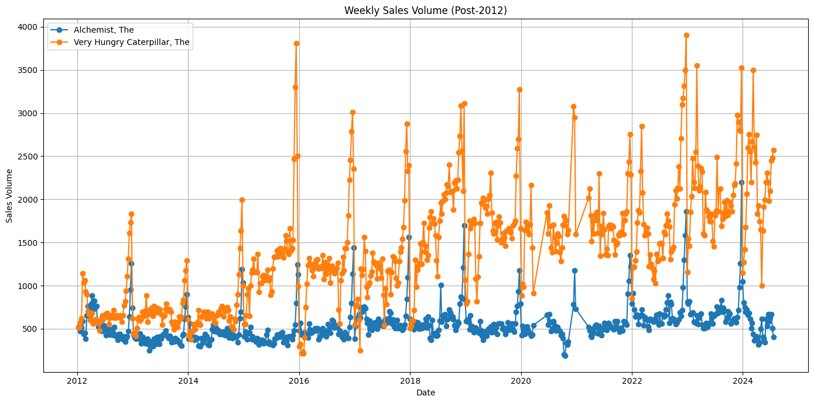
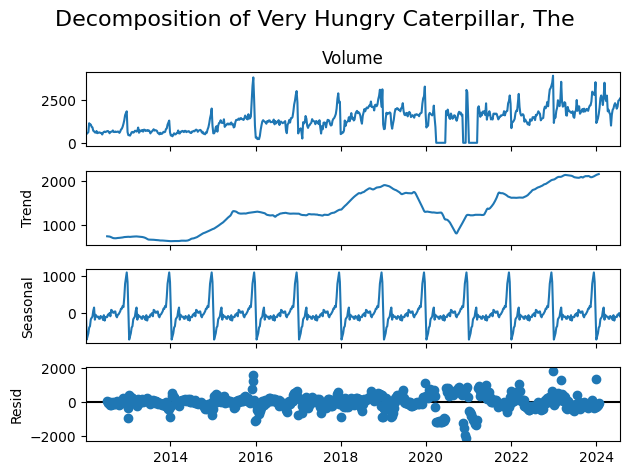
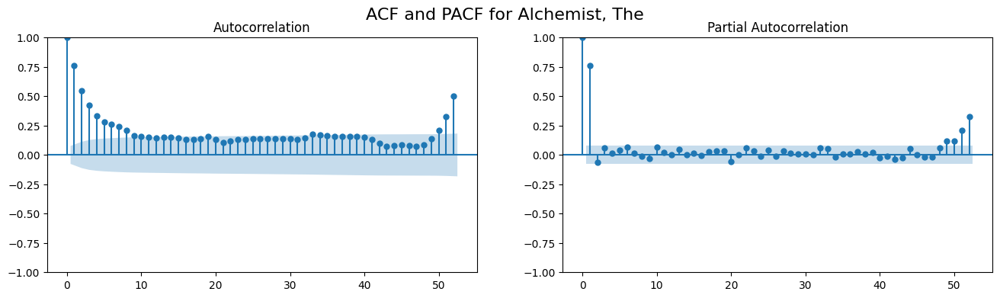
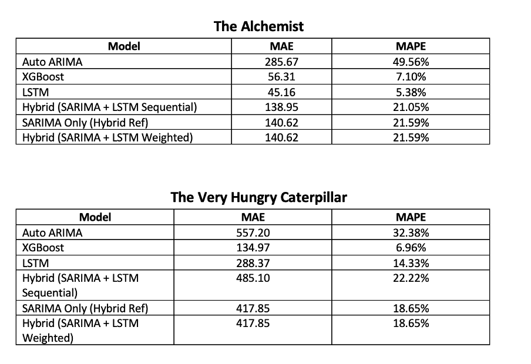

# Predicting Book Sales and Demand Using Time Series Forecasting

---

## Table of Contents

1. [Executive Summary](#1-executive-summary)  
2. [Problem Statement](#2-problem-statement)  
3. [Solution Approach](#3-solution-approach)  
4. [Model Performance Comparison](#4-model-performance-comparison)  
5. [Conclusion and Recommendations](#5-conclusion-and-recommendations)

---

## 1. Executive Summary

This project leverages time series analysis to forecast book sales using historical data from Nielsen BookScan, spanning from 2000 to 2024. The objective is to model sales patterns and generate accurate forecasts to support small and medium-sized publishers in making data-driven decisions.

By identifying seasonal trends and demand cycles, these forecasts enable more informed reordering, restocking, and reprinting strategies, ultimately improving operational efficiency and profitability.

A range of forecasting models were evaluated, including traditional statistical methods such as ARIMA and advanced machine learning techniques like XGBoost and LSTM. The models were tested on two consistently high-performing titles: _The Alchemist_ and _The Very Hungry Caterpillar_. Both titles demonstrated clear seasonal sales patterns and long-term commercial stability.

<h3 align="center">
  
</h3>

Among the models, XGBoost and LSTM achieved the highest predictive accuracy. These models are well-suited for deployment in publishing operations to help maintain optimal stock levels, minimise the risk of overstocking or stockouts, and support long-term sales planning.

---

## 2. Problem Statement

Small to medium-sized independent publishers face significant challenges in making informed investment decisions about new publications due to limited access to advanced sales forecasting tools and analytics. While these publishers recognise the value of historical sales data for predicting demand, managing stock, and estimating the economic lifespan of a title, they often lack the resources to develop and maintain such infrastructure in-house.

This project supports Nielsen in addressing this gap by developing a data-driven forecasting service aimed at helping publishers:

- Make more accurate predictions of a title’s overall sales profile post-publication  
- Improve stock control and reduce costly over- or understocking  
- Inform initial print volume and investment decisions  
- Estimate the useful economic lifespan of a title

There is a clear market demand for reliable, actionable insights in this space.

---

## 3. Solution Approach

The analysis was conducted at weekly sales volume granularity, offering a high-resolution view of demand fluctuations, seasonal patterns, and promotional spikes. This level of detail was essential for developing accurate forecasts and ensuring responsiveness to short-term sales dynamics.

The process began with time series decomposition and autocorrelation diagnostics to uncover underlying patterns and inform model selection. Seasonal and trend components were extracted, revealing both cyclical and long-term behaviours in the data. ACF and PACF plots were used to identify lag relationships, confirming the presence of seasonality and guiding the choice of forecasting models.

 

<h3 align="center">
  
</h3>

  

<h3 align="center">
  
</h3>

  

Stationarity was assessed using the Augmented Dickey-Fuller (ADF) test. Both _The Alchemist_ and _The Very Hungry Caterpillar_ returned p-values below 0.05, suggesting stationarity. Notably, for _The Very Hungry Caterpillar_, this result was somewhat unexpected given the trend and variance shifts observed in decomposition plots—highlighting the importance of combining statistical tests with visual diagnostics.

 

<h3 align="center">
  
</h3>

  

<h3 align="center">
  
</h3>

  

Residual diagnostics showed general independence, although some deviations from normality suggest the influence of external shocks or white noise not fully captured by the models.

A range of forecasting models was tested, including:

- **Auto-ARIMA**  
- **XGBoost**  
- **LSTM (Long Short-Term Memory)**  
- **Hybrid SARIMA-LSTM**

Each model underwent parameter tuning and evaluation. In some cases, weighted blending was applied to optimise predictive performance and provide more robust comparisons across modelling approaches.

---

## 4. Model Performance Comparison 

To evaluate forecasting accuracy, several models were applied to weekly sales data for both _The Alchemist_ and _The Very Hungry Caterpillar_. Performance was assessed using **Mean Absolute Error (MAE)** and **Mean Absolute Percentage Error (MAPE)**.

 

<h3 align="center">
  
</h3>

  

### 🔸 XGBoost Model Performance

XGBoost consistently outperformed the other models, particularly for _The Very Hungry Caterpillar_, which yielded the best results overall. Its strength in capturing non-linear relationships and handling sharp fluctuations makes it particularly well-suited to sales data with irregular patterns and pronounced seasonality.

 

<h3 align="center">
  
</h3>

  

### 🔸 LSTM Model Performance

For _The Alchemist_, the LSTM model delivered the best performance (MAE: 45.16; MAPE: 5.38%), likely due to its stable weekly sales pattern (~500–600 units), which enabled the model to effectively capture long-term dependencies. 

<h3 align="center">
  
</h3>

  

In contrast, LSTM performance for _The Very Hungry Caterpillar_ was weaker (MAE: 288.37; MAPE: 14.33%) due to the more erratic sales patterns from 1,000 to over 3,500 units per week, with strong seasonal spikes (e.g., during holiday periods). These results reinforce the importance of matching model characteristics to the nature of the underlying data.

 

### 🔸 Hybrid Model Evaluation (SARIMA + LSTM)

Hybrid models combining SARIMA and LSTM—whether applied sequentially or blended using weighted averages—did not outperform their standalone components.

- Performance gains over SARIMA alone were marginal at best.
- In all cases, either XGBoost or LSTM alone delivered better accuracy.

 

### 🔸 Hybrid Model – Weight Adjustment Analysis

- **_Alchemist_**: Weight tuning of the hybrid model showed no meaningful benefit. Even the best combination (100% SARIMA) resulted in an MAE of **140.62**—significantly worse than either LSTM or XGBoost alone.  
- **_Caterpillar_**: Similarly, no improvement was observed. The best hybrid configuration (100% SARIMA) yielded an MAE of **417.85**, which was still notably inferior to XGBoost (**MAE: 134.97**).

 

### 🟢 Model Selection Considerations

- **XGBoost** emerged as the most **reliable and accurate** model overall—especially where sales data exhibited strong volatility or seasonality.
- **LSTM** performed exceptionally well under **stable demand conditions**, as demonstrated with _Alchemist_.
- **Hybrid models**, while theoretically appealing, did not demonstrate practical benefits within this dataset. Significant fine-tuning would be required for them to be considered viable alternatives.

---

## 5. Conclusion and Recommendations

Following the comprehensive comparative analysis of multiple forecasting approaches, the most effective models identified are:

- **The Alchemist:** LSTM (Weekly Dataset) – MAE: 45.16, MAPE: 5.38%  
- **The Very Hungry Caterpillar:** XGBoost (Weekly Dataset) – MAE: 134.97, MAPE: 6.96%

These models delivered the highest accuracy among all tested methods, consistently capturing the temporal patterns of each title’s sales dynamics.

Nielsen can deploy these models as part of a forecasting service aimed at small to medium-sized publishers, enabling:

- Smarter reordering, restocking, and reprinting decisions  
- More accurate estimates of post-launch sales and the economic lifespan of titles  
- Reduced risk of overstocking or stockouts

This scalable solution supports publishers lacking in-house analytics capabilities and aligns with Nielsen’s goal of providing premium, data-driven decision tools.

---

